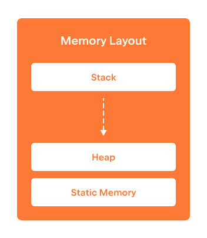

So far, we have learned that the memory of the program
consists of individual addressable memory cells.
We have also learned how to take the addresses of variables in the memory and
how to store and move them around using pointers.
What we have not yet learned is how the memory
is allocated and freed once the variables occupying
this memory are not needed anymore.
Indeed, like in our day-to-day life, it is very important to recycle resources
(in our case, the program's memory). If the program keeps allocating
memory for new variables but never deallocates it back,
it can eventually exceed all the memory available on the user's machine.

In most modern programming languages, memory deallocation is done
automatically, behind the back of the programmer, by the
subsystem of the language known as 
[garbage collector](https://en.wikipedia.org/wiki/Garbage_collection_(computer_science)).
While this is indeed very convenient, since it frees
the programmer from the burden to manage memory manually,
garbage collection comes with costs:

* it takes some fraction of the program's running time to search for unused memory, and
* it can introduce some unexpected pauses and thus, hurt the responsiveness
  and throughput of the program.

C++ tends to provide to the programmer maximum control over how the program is run.
This includes the possibility to manually manage memory allocation and freeing.

In C++, there are three distinct memory regions governed by
different memory management policies:

* global static memory,
* stack memory, and
* dynamic heap memory.

In the following steps, you will learn about all of them.

