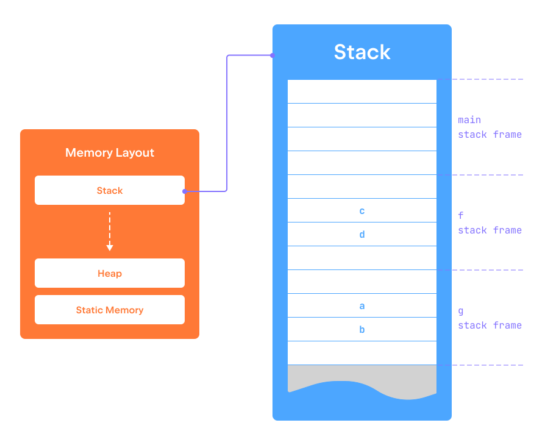

Local variables declared inside functions 
are kept in the __stack__ memory region.
This memory region is partitioned into chunks called _stack frames_.
Each time some function is called, a 
stack frame containing all the local variables of this function is 
pushed onto the top of the stack. 
Once the execution of the function finishes, 
the corresponding stack frame is popped from the stack.  

The memory management policy of this memory region resembles 
the [stack data structure](https://en.wikipedia.org/wiki/Stack_(abstract_data_type)), 
hence the name.   

The program attached to this step defines two functions:
`f` and `g`, each declaring two local variables
and then printing their addresses. 
The function `g` is called from `f`, and `f` 
itself is called from the main function. 
Run the program to see what addresses were assigned to these variables.
Note that the addresses monotonically increase 
(or decrease, depending on your system), 
thus showing the direction of stack growth in the memory space.

