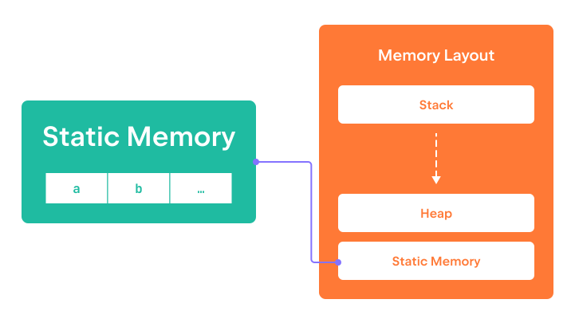

Static memory contains all the global variables, 
as well as the code of the program itself. 
Static memory is allocated and initialized at the start of the program, 
and it is freed only when the program terminates.  
Therefore, the memory in this region is available 
during the whole runtime of the program.

The program attached to this step defines two global variables 
and prints their addresses to the terminal. 
Run this program to see what addresses were assigned to these variables.

